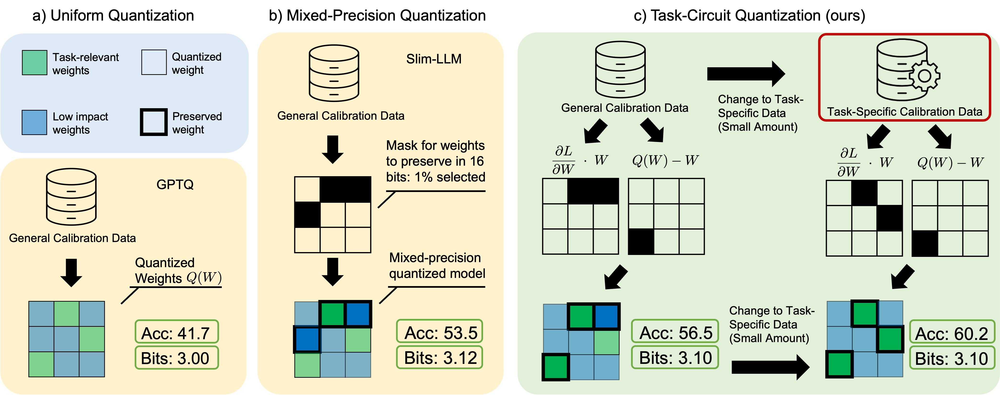

# Task Circuit Quantization
Official Repository for [Task Circuit Quantization (TaCQ)](https://arxiv.org/abs/2504.07389)
[https://arxiv.org/abs/2504.07389](https://arxiv.org/abs/2504.07389)

Authors: [Hanqi Xiao](https://hanqixiao.github.io/), [Yi-Lin Sung](https://ylsung.github.io/), [Elias Stengel-Eskin](https://esteng.github.io/), [Mohit Bansal](https://www.cs.unc.edu/~mbansal/)

## Abstract
Post-training quantization (PTQ) reduces a model's memory footprint by mapping full precision weights into low bit weights without costly retraining, but can degrade its downstream performance especially in low 2- to 3-bit settings. We develop a new mixed-precision PTQ approach, Task-Circuit Quantization (TaCQ), that draws parallels to automated circuit discovery, directly conditioning the quantization process on specific weight circuits -- which we define as sets of weights associated with downstream task performance. These weights are kept as 16-bit weights, while others are quantized, maintaining performance while only adding a marginal memory cost. Specifically, TaCQ contrasts unquantized model weights with a uniformly-quantized model to estimate the expected change in weights due to quantization and uses gradient information to predict the resulting impact on task performance, allowing us to preserve task-specific weights. We compare TaCQ-based quantization to existing mixed-precision quantization methods when conditioning both on general-purpose and task-specific data. Across QA, math reasoning, and text-to-SQL tasks for both Llama-3 and Qwen2.5, we find that TaCQ outperforms baselines using the same calibration data and a lower weight budget, achieving major improvements in the 2 and 3-bit regime. With only 3.1 bits we are able to recover 96% of Llama-3-8B-Instruct's unquantized 16-bit MMLU performance, obtaining a 5.25% absolute improvement over SPQR. We also observe consistently large gains over existing methods in the 2-bit regime, with an average gain of 14.74% over the strongest baseline, SliM-LLM. Moreover, we observe a 7.20% gain without conditioning on specific tasks, showing TaCQ's ability to identify important weights is not limited to task-conditioned settings.




# Installation

## Packages
Please make sure that you have torch compiled with `CUDA` enabled. Repository developed with `python 3.12.2`, please ensure `python` envokes `python 3.12.2`.

Create virtual environment and Install packages from `requirements.txt`:
```bash
python -m venv tacq_venv
source tacq_venv/bin/activate
pip install -r requirements.txt
```

## Dataset Setup
Please reference [`datasets_directory/DATASETS.md`](./datasets_directory/DATASETS.md) to setup datasets if you desire to evaluate on the Spider text to SQL dataset or implement your own dataset. Evaluation on perplexity, MMLU and GSM8k datasets require no additional setup.

## Run Evaluations
Evaluate Llama-3-8B-Instruct by conditioning only on the c4_new dataset and evaluating on all other datasets. `scripts/examples/evaluate_llama3_8b.sh`; This only applies TACQ to the model 2 times once for 2 bit, once for 3 bit. 
Evaluate Llama-3-8B-Instruct on all datasets `scripts/examples/evaluate_llama3_8b.sh` This applies TACQ to the model DATASET x 2 times, where we condition on each dataset, and for both 2 bit and 3 bit.
Evaluate Qwen-2.5-7B-Instruct on all datasets `scripts/examples/evaluate_qwen2p5_7b.sh`

### Specify Paths
Ensure that the following variables are defined according to your system.
Importances for each weight will be stored in `importances_dir`, there are large files on the scale of model checkpoints, and `model_checkpoints` store 16 bit model checkpoints and it is recommended to use large hdd for these directories. 
Results will be stored in `results_dir`, results are text files, csvs, or json and should be lightweight. Ensure you specify `device` as arguments to `CUDA_VISIBLE_DEVICES` for collecting the gradient, and `eval_device` as the arguments to `CUDA_VISIBLE_DEVICES` for evaluating a model. 

```bash
importances_dir="/importances_dir/results"
results_dir="/eval_dir/results"
checkpoints_dir="/model_checkpoints"
device="0,2,3"
eval_device="0"
```

### Adjust Configurations
To select the base bitness, it is possible to add qN to `quantization_types` where N is the desired bitness.
The `ratios` variable specify the percentage of outliers to preserve and can adjust the average bitness. 
To use 16 bit gradients instead of 32 bit gradients, set `selector_types` to `sample_abs_weight_prod_contrastive_sm16bit`.
By adding to variables that are defined as lists, the script will evaluate all settings specified in the list.

```bash
quantization_types=("q2" "q3")
ratios=(".0035")
selector_types=("sample_abs_weight_prod_contrastive")
```

Execute by sourcing the relevant script.
```bash
source scripts/examples/evaluate_llama3_8b.sh
```

After the gradient based weight importance information have been collected for a particular conditioning dataset and base bit-width, it is possible to increase/decrease the number of outliers and thus adjust compression ratio without recollecting the gradients, saving the majority of the quantization time. Weight importance information is automatically saved at user defined `importances_dir`.
